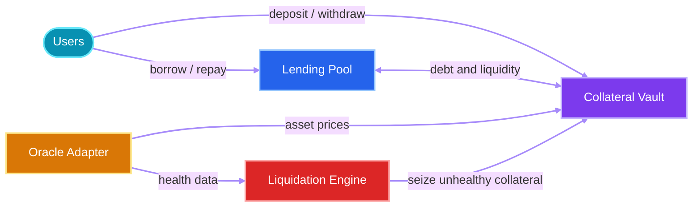

<p align="center">
  
</p>


<p align="center">
  <strong>Open-source RWA lending infrastructure built on Stellar and Soroban.</strong>
</p>

<p align="center">
  Deposit tokenized real-world assets, access on-chain liquidity, and manage risk through a modular smart-contract architecture.
</p>

<p align="center">
  <a href="https://github.com/Alien-Protocol/Alien-Protocol/actions/workflows/contract.yml">
    
  </a>
  <a href="https://github.com/Alien-Protocol/Alien-Protocol/commits/main">
    
  </a>
  <a href="https://github.com/Alien-Protocol/Alien-Protocol/issues">
    
  </a>
  <a href="LICENSE">
    
  </a>
</p>

<p align="center">
  
  
  
  
</p>

<p align="center">
  <a href="#-about">About</a> •
  <a href="#-architecture">Architecture</a> •
  <a href="#-getting-started">Getting started</a> •
  <a href="#-contributing">Contributing</a> •
  <a href="#-license">License</a>
</p>

> [!WARNING]
> Alien Protocol is under active development and has not been audited. Do not use these contracts with production funds.

## 👽 About

Alien Protocol is a modular credit layer for tokenized real-world assets on Stellar. It is designed to make RWA-backed borrowing transparent, programmable, and easier for applications to integrate.

The protocol separates collateral custody, liquidity, pricing, and liquidation into focused Soroban contracts. This keeps responsibilities clear and allows each part of the lending lifecycle to evolve independently.

### Why Alien Protocol?

- **RWA-focused** — lending primitives designed around tokenized real-world collateral.
- **Built on Stellar** — fast settlement and Soroban-native smart contracts.
- **Modular by design** — isolated contracts for collateral, liquidity, prices, and liquidations.
- **Transparent risk controls** — on-chain positions, price freshness checks, pause controls, and liquidation paths.
- **Open source** — public development with community issues and pull requests welcome.

## 🛸 Architecture



The diagram represents the target protocol flow. Individual modules are being completed incrementally.

| Component | Responsibility | Status |
| --- | --- | :---: |
| [`collateral-vault`](contracts/collateral-vault) | Collateral deposits, withdrawals, asset support, position valuation, and seizure | 🟢 In development |
| [`oracle-adapter`](contracts/oracle-adapter) | Asset prices, freshness checks, authorized feeders, and RedStone push/pull models | 🟢 In development |
| [`lending-pool`](contracts/lending-pool) | Liquidity, borrowing, repayment, and debt accounting | 🟡 Scaffolded |
| [`liquidation-engine`](contracts/liquidation-engine) | Position health monitoring and liquidation execution | 🟡 Scaffolded |
| [`shared`](contracts/shared) | Shared protocol types, errors, constants, and events | 🟢 In development |

## ✨ Current capabilities

- Soroban-native Rust workspace with optimized WASM release settings.
- Collateral asset allowlisting and per-user position tracking.
- Deposit, withdrawal, valuation, and collateral-seizure flows.
- Administrative pause and role-transfer controls.
- Oracle price publication with staleness validation.
- RedStone push- and pull-model oracle integration.
- Native contract tests and automated formatting, linting, build, and test checks.

## 🚀 Getting started

### Prerequisites

- [Rust](https://www.rust-lang.org/tools/install) with `rustup`
- [Stellar CLI](https://developers.stellar.org/docs/tools/developer-tools/cli/stellar-cli)
- Git
- The `wasm32v1-none` Rust target

### 1. Clone the repository

```bash
git clone https://github.com/Alien-Protocol/Alien-Protocol.git
cd Alien-Protocol
```

### 2. Prepare the toolchain

```bash
rustup target add wasm32v1-none
stellar --version
```

### 3. Build the test fixture

The collateral-vault upgrade tests load their release WASM at compile time, so build that artifact before running native tests:

```bash
cargo build -p collateral-vault --target wasm32v1-none --release
```

### 4. Run the test suite

```bash
cargo test --workspace --all-features
```

### 5. Build the contracts

```bash
stellar contract build --locked
```

The Stellar CLI builds every contract crate in the workspace, uses the release profile, and optimizes the generated WASM by default. Compiled contracts are written to `target/wasm32v1-none/release/`.

## 🧪 Quality checks

Run the full local verification suite before opening a pull request:

```bash
cargo fmt --all --check
cargo build -p collateral-vault --target wasm32v1-none --release
cargo clippy --workspace --all-targets --all-features -- -D warnings
cargo check --workspace
cargo test --workspace --all-features
stellar contract build --locked
```

## 📁 Repository structure

```text
Alien-Protocol/
├── .github/
│   ├── ISSUE_TEMPLATE/       # Contribution templates
│   └── workflows/            # Contract CI
├── contracts/
│   ├── collateral-vault/     # Collateral custody and positions
│   ├── lending-pool/         # Borrowing and liquidity
│   ├── liquidation-engine/   # Unhealthy-position liquidation
│   ├── oracle-adapter/       # Price feeds and RedStone integration
│   └── shared/               # Shared protocol primitives
├── docs/
│   ├── CONTRIBUTING.md       # Contribution workflow and conventions
│   ├── arch.md               # Architecture documentation
│   └── TODO.md               # Open contract and project work
├── LICENSE
├── Cargo.toml                # Rust workspace configuration
└── README.md
```

## 🤝 Contributing

Contributions of all sizes are welcome. Read the [contribution guide](docs/CONTRIBUTING.md) for the complete setup, branch naming, commit-message format, quality checks, and pull-request checklist.

A good first step is to browse the [open issues](https://github.com/Alien-Protocol/Alien-Protocol/issues). For larger features or protocol changes, open an issue before implementation so the approach can be discussed with the maintainers.

## 🔐 Security

If you discover a security vulnerability, please avoid opening a public issue that exposes it. Contact the maintainers privately through the repository owner's GitHub profile until a dedicated security policy and reporting channel are published.

## 📄 License

Alien Protocol is open-source software licensed under the [MIT License](LICENSE).

---

<p align="center">
  <strong>Building the credit layer for tokenized assets on Stellar.</strong>
</p>

<p align="center">
  If this project interests you, consider giving it a ⭐ and joining the conversation.
</p>
